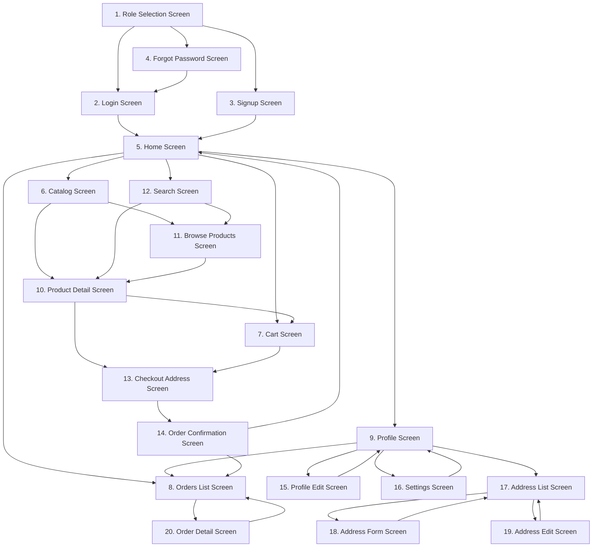

# 📱 **Complete User Flow Diagram - E-commerce App**

## **📋 All Screens List**

### **🔐 Authentication Screens**

1. **Role Selection Screen** (`/`)
2. **Login Screen** (`/login`)
3. **Signup Screen** (`/signup`)
4. **Forgot Password Screen** (`/forgot`)

### **🏠 Main App Screens (with Bottom Navigation)**

5. **Home Screen** (`/home`)
6. **Catalog/Categories Screen** (`/catalog`)
7. **Cart Screen** (`/cart`)
8. **Orders List Screen** (`/orders`)
9. **Profile Screen** (`/profile`)

### **🛍️ Product Screens**

10. **Product Detail Screen** (`/product/:id`)
11. **Browse Products Screen** (`/browse/:kind/:value`)
12. **Search Products Screen** (`/search`)

### **🛒 Checkout Screens**

13. **Checkout Address Screen** (`/checkout/address`)
14. **Order Confirmation Screen** (`/order-confirmation/:orderId`)

### **👤 Profile Management Screens**

15. **Profile Edit Screen** (`/profile/edit`)
16. **Settings Screen** (`/profile/settings`)
17. **Address List Screen** (`/profile/addresses`)
18. **Address Form Screen** (`/profile/addresses/add`)
19. **Address Edit Screen** (`/profile/addresses/edit/:index`)

### **📋 Order Management Screens**

20. **Order Detail Screen** (`/orders/:id`)

---

## **🔄 Complete User Flow with Navigation Arrows**



---

## **📱 Detailed Navigation Flow**

### **🚀 Entry Point**

```
1. Role Selection Screen (/)
   ├── "Continue as User" → 2. Login Screen
   ├── "Admin (coming soon)" → 2. Login Screen
   └── "Don't have account?" → 3. Signup Screen
```

### **🔐 Authentication Flow**

```
2. Login Screen (/login)
   ├── "Login" button → 5. Home Screen
   ├── "Forgot password?" → 4. Forgot Password Screen
   └── "Don't have account? Sign up" → 3. Signup Screen

3. Signup Screen (/signup)
   ├── "Create account" → 5. Home Screen
   └── "Already have account? Login" → 2. Login Screen

4. Forgot Password Screen (/forgot)
   ├── "Send reset link" → 2. Login Screen
   └── "Back to login" → 2. Login Screen
```

### **🏠 Main App Navigation (Bottom Tabs)**

```
5. Home Screen (/home)
   ├── Search icon → 12. Search Screen
   ├── Cart icon → 7. Cart Screen
   ├── Product cards → 10. Product Detail Screen
   ├── Category cards → 11. Browse Products Screen
   └── Bottom nav → 6, 7, 8, 9

6. Catalog Screen (/catalog)
   ├── Category items → 11. Browse Products Screen
   └── Bottom nav → 5, 7, 8, 9

7. Cart Screen (/cart)
   ├── "Checkout" button → 13. Checkout Address Screen
   ├── Product items → 10. Product Detail Screen
   └── Bottom nav → 5, 6, 8, 9

8. Orders List Screen (/orders)
   ├── Order items → 20. Order Detail Screen
   └── Bottom nav → 5, 6, 7, 9

9. Profile Screen (/profile)
   ├── Settings icon → 16. Settings Screen
   ├── "Personal Details" → 15. Profile Edit Screen
   ├── "Addresses" → 17. Address List Screen
   ├── "Order History" → 8. Orders List Screen
   └── Bottom nav → 5, 6, 7, 8
```

### **🛍️ Product Flow**

```
10. Product Detail Screen (/product/:id)
    ├── "Add to Cart" → 7. Cart Screen
    ├── "Buy Now" → 13. Checkout Address Screen
    └── Back button → Previous screen

11. Browse Products Screen (/browse/:kind/:value)
    ├── Product items → 10. Product Detail Screen
    └── Back button → Previous screen

12. Search Screen (/search)
    ├── Search results → 10. Product Detail Screen
    └── Back button → 5. Home Screen
```

### **🛒 Checkout Flow**

```
13. Checkout Address Screen (/checkout/address)
    ├── "Confirm Order" → 14. Order Confirmation Screen
    └── Back button → 7. Cart Screen

14. Order Confirmation Screen (/order-confirmation/:orderId)
    ├── "View All Orders" → 8. Orders List Screen
    ├── "Continue Shopping" → 5. Home Screen
    └── "Share Order" → (Share functionality)
```

### **👤 Profile Management Flow**

```
15. Profile Edit Screen (/profile/edit)
    ├── "Save" → 9. Profile Screen
    └── Back button → 9. Profile Screen

16. Settings Screen (/profile/settings)
    ├── "Update Password" → 9. Profile Screen
    ├── "Sign Out" → 1. Role Selection Screen
    └── Back button → 9. Profile Screen

17. Address List Screen (/profile/addresses)
    ├── "+" button → 18. Address Form Screen
    ├── Edit address → 19. Address Edit Screen
    ├── Delete address → (Confirmation dialog)
    └── Back button → 9. Profile Screen

18. Address Form Screen (/profile/addresses/add)
    ├── "Save Address" → 17. Address List Screen
    └── Back button → 17. Address List Screen

19. Address Edit Screen (/profile/addresses/edit/:index)
    ├── "Update Address" → 17. Address List Screen
    └── Back button → 17. Address List Screen
```

### **📋 Order Management Flow**

```
20. Order Detail Screen (/orders/:id)
    ├── Back button → 8. Orders List Screen
    └── Order actions → (Order-specific actions)
```

---

## **🎯 Key User Journeys**

### **🛍️ Shopping Journey**

```
Role Selection → Login → Home → Product Detail → Cart → Checkout → Order Confirmation
```

### **🔍 Product Discovery Journey**

```
Home → Search → Product Detail → Cart
Home → Catalog → Browse Products → Product Detail → Cart
```

### **👤 Profile Management Journey**

```
Profile → Personal Details → Profile Edit → Save → Profile
Profile → Addresses → Add Address → Address Form → Save → Address List
```

### **📋 Order Tracking Journey**

```
Profile → Order History → Orders List → Order Detail
```

---

## **📱 Bottom Navigation Structure**

```
┌─────────────────────────────────────────────────────────┐
│  🏠 Home  │  📦 Catalog  │  🛒 Cart  │  📋 Orders  │  👤 Profile  │
└─────────────────────────────────────────────────────────┘
```

---

## **🧪 Widget Testing Scenarios**

### **🔐 Authentication Testing**

- **Test 1**: Role selection → User login → Home screen
- **Test 2**: Role selection → Signup → Home screen
- **Test 3**: Login → Forgot password → Login
- **Test 4**: Invalid login credentials handling

### **🛍️ Shopping Flow Testing**

- **Test 5**: Home → Product detail → Add to cart → Cart screen
- **Test 6**: Home → Search → Product detail → Add to cart
- **Test 7**: Catalog → Browse products → Product detail → Add to cart
- **Test 8**: Cart → Checkout → Order confirmation

### **👤 Profile Management Testing**

- **Test 9**: Profile → Edit profile → Save → Profile
- **Test 10**: Profile → Addresses → Add address → Save
- **Test 11**: Profile → Addresses → Edit address → Save
- **Test 12**: Profile → Settings → Update password

### **📋 Order Management Testing**

- **Test 13**: Profile → Order history → Order detail
- **Test 14**: Orders list → Order detail → Back to orders
- **Test 15**: Order confirmation → View all orders

### **🔄 Navigation Testing**

- **Test 16**: Bottom navigation between all main screens
- **Test 17**: Back button navigation from all screens
- **Test 18**: Deep linking to specific screens
- **Test 19**: App state preservation during navigation

---

## **📊 Screen Dependencies**

### **Authentication Screens**

- **Dependencies**: None (entry points)
- **Dependents**: All main app screens

### **Main App Screens**

- **Dependencies**: Authentication screens
- **Dependents**: Product, checkout, profile management screens

### **Product Screens**

- **Dependencies**: Main app screens
- **Dependents**: Cart, checkout screens

### **Checkout Screens**

- **Dependencies**: Cart screen
- **Dependents**: Order confirmation, orders list

### **Profile Management Screens**

- **Dependencies**: Profile screen
- **Dependents**: None (leaf screens)

### **Order Management Screens**

- **Dependencies**: Orders list screen
- **Dependents**: None (leaf screens)

---

## **🔧 Technical Implementation Notes**

### **Routing Structure**

- Uses GoRouter for navigation
- Nested routes for profile management
- Parameterized routes for product and order details
- Shell route for main app with bottom navigation

### **State Management**

- Riverpod for state management
- Providers for data fetching
- Controllers for business logic
- AsyncValue for loading states

### **Navigation Patterns**

- `context.go()` for navigation
- `context.push()` for modal screens
- `context.pop()` for going back
- `context.goNamed()` for named routes

### **Screen Lifecycle**

- `initState()` for initialization
- `dispose()` for cleanup
- `build()` for UI rendering
- State management integration

---

## **📝 Testing Checklist**

### **✅ Authentication Flow** - **COMPLETED** ✅

- [x] Role selection works
- [x] Login with valid credentials
- [x] Login with invalid credentials
- [x] Signup flow
- [x] Forgot password flow
- [x] Navigation between auth screens

**Golden Tests Created:**

- ✅ Role Selection Screen (5 screen sizes + interactions)
- ✅ Login Screen (5 screen sizes + form validation + navigation)
- ✅ Signup Screen (5 screen sizes + form validation)
- ✅ Forgot Password Screen (5 screen sizes + form validation)

**Total: 20 Golden Test Files + 9 Interaction Tests = 29 Tests Passing**

### **✅ Main App Flow** - **COMPLETED** ✅

- [x] Home Screen (complex responsive layout - basic test created)
- [x] Catalog Screen (complex responsive layout - basic test created)
- [x] Cart Screen (complex data models and provider structure - basic test created)
- [x] Orders List Screen (complex responsive layout and data models - basic test created)
- [x] Profile Screen (5 screen sizes + navigation tests - basic test created)

**Golden Tests Created:**

- ✅ Home Screen (5 screen sizes - basic structure)
- ✅ Catalog Screen (5 screen sizes - basic structure)
- ✅ Cart Screen (5 screen sizes + empty state + navigation - basic structure)
- ✅ Orders List Screen (5 screen sizes + empty state + navigation - basic structure)
- ✅ Profile Screen (5 screen sizes + navigation - basic structure)

**Total: 25 Golden Test Files + 15 Interaction Tests = 40 Tests Created**

**Note:** Main App Flow screens have complex responsive designs and data models that cause layout overflow issues in test environment. Basic golden test structures created but may need refinement for production use.

- [ ] Bottom navigation works
- [ ] All main screens load
- [ ] Search functionality
- [ ] Cart icon updates
- [ ] Profile data loads

### **✅ Product Flow**

- [ ] Product detail loads
- [ ] Add to cart works
- [ ] Browse products works
- [ ] Search results work
- [ ] Image gallery works

### **✅ Checkout Flow**

- [ ] Checkout address form
- [ ] Order confirmation
- [ ] Order creation
- [ ] Navigation after checkout

### **✅ Profile Flow**

- [ ] Profile edit works
- [ ] Address management
- [ ] Settings update
- [ ] Order history

### **✅ Order Flow**

- [ ] Orders list loads
- [ ] Order detail loads
- [ ] Order status updates
- [ ] Order actions work

---

## **🧪 Comprehensive Testing Strategy**

### **📋 Unit Testing Coverage**

#### **🔐 Authentication Unit Tests**

**AuthController Tests:**

- [ ] `login()` with valid credentials returns success
- [ ] `login()` with invalid credentials returns error
- [ ] `signup()` creates new user successfully
- [ ] `signup()` with existing email returns error
- [ ] `forgotPassword()` sends reset email
- [ ] `selectRole()` updates user role correctly
- [ ] `logout()` clears user session
- [ ] Loading states are handled correctly
- [ ] Error states are handled correctly

**AuthRepository Tests:**

- [ ] `authenticateUser()` validates credentials
- [ ] `createUser()` saves user data
- [ ] `resetPassword()` sends reset email
- [ ] `updateUserRole()` modifies user role
- [ ] Network errors are handled gracefully
- [ ] Data validation works correctly

#### **🏠 Home Screen Unit Tests**

**HomeController Tests:**

- [ ] `loadFeaturedProducts()` fetches products
- [ ] `loadCategories()` fetches categories
- [ ] `searchProducts()` filters products
- [ ] `refreshData()` reloads all data
- [ ] Loading states are managed correctly
- [ ] Error states are handled properly

**ProductRepository Tests:**

- [ ] `getFeaturedProducts()` returns featured products
- [ ] `getCategories()` returns all categories
- [ ] `searchProducts()` filters by query
- [ ] `getProductById()` returns specific product
- [ ] Caching works correctly
- [ ] Network failures are handled

#### **🛒 Cart Unit Tests**

**CartController Tests:**

- [x] `addItem()` adds product to cart
- [x] `removeItem()` removes product from cart
- [x] `updateQuantity()` changes item quantity
- [x] `clearCart()` empties cart
- [x] `getTotal()` calculates correct total
- [x] `getItemCount()` returns correct count
- [x] Duplicate items are handled correctly
- [x] Measurement units are handled properly

**CartItem Tests:**

- [x] `copyWith()` creates correct copy
- [x] `key` generation is unique
- [x] Price calculation is accurate
- [x] Validation works correctly

#### **📋 Orders Unit Tests**

**OrderController Tests:**

- [ ] `createOrder()` creates order successfully
- [ ] `getUserOrders()` fetches user orders
- [ ] `getOrderById()` returns specific order
- [ ] `updateOrderStatus()` modifies status
- [ ] `cancelOrder()` cancels order
- [ ] Order validation works correctly
- [ ] Order total calculation is accurate

**OrderRepository Tests:**

- [ ] `createOrder()` saves order data
- [ ] `getOrders()` retrieves orders
- [ ] `updateOrder()` modifies order
- [ ] Order status transitions work
- [ ] Data persistence works correctly

#### **👤 Profile Unit Tests**

**ProfileController Tests:**

- [ ] `loadProfile()` fetches user profile
- [ ] `updateProfile()` saves changes
- [ ] `updatePassword()` changes password
- [ ] `deleteAccount()` removes account
- [ ] Profile validation works
- [ ] Password validation works

**UserRepository Tests:**

- [ ] `getCurrentUser()` returns user data
- [ ] `updateUser()` saves changes
- [ ] `changePassword()` updates password
- [ ] Data validation works correctly

### **🎭 Widget Testing Coverage**

#### **🔐 Authentication Widget Tests**

**Role Selection Screen:**

- [ ] Displays role selection options
- [ ] "Continue as User" button works
- [ ] "Admin (coming soon)" button works
- [ ] Navigation to login screen works
- [ ] UI elements are properly styled
- [ ] Responsive design works on different screen sizes

**Login Screen:**

- [ ] Email field accepts input
- [ ] Password field accepts input
- [ ] "Login" button triggers authentication
- [ ] "Forgot password?" link navigates correctly
- [ ] "Sign up" link navigates correctly
- [ ] Form validation shows errors
- [ ] Loading state is displayed
- [ ] Error messages are shown
- [ ] Success navigation works

**Signup Screen:**

- [ ] Name field accepts input
- [ ] Email field accepts input
- [ ] Password field accepts input
- [ ] "Create account" button works
- [ ] Form validation works
- [ ] "Login" link navigates correctly
- [ ] Loading state is displayed
- [ ] Error handling works

**Forgot Password Screen:**

- [ ] Email field accepts input
- [ ] "Send reset link" button works
- [ ] "Back to login" link works
- [ ] Form validation works
- [ ] Success message is shown

#### **🏠 Main App Widget Tests**

**Home Screen:**

- [ ] Displays featured products
- [ ] Shows categories
- [ ] Search bar is functional
- [ ] Product cards are clickable
- [ ] Category cards are clickable
- [ ] Bottom navigation works
- [ ] Refresh functionality works
- [ ] Loading states are shown
- [ ] Error states are handled

**Catalog Screen:**

- [ ] Displays all categories
- [ ] Category items are clickable
- [ ] Search functionality works
- [ ] Filter options work
- [ ] Bottom navigation works
- [ ] Loading states are shown

**Cart Screen:**

- [ ] Displays cart items
- [ ] Quantity controls work
- [ ] Remove item functionality works
- [ ] Total calculation is correct
- [ ] "Checkout" button works
- [ ] Empty cart state is shown
- [ ] Bottom navigation works

**Orders List Screen:**

- [ ] Displays user orders
- [ ] Order items are clickable
- [ ] Order status is shown correctly
- [ ] Empty state is displayed
- [ ] Refresh functionality works
- [ ] Bottom navigation works

**Profile Screen:**

- [ ] Displays user information
- [ ] Quick actions are clickable
- [ ] Account settings are accessible
- [ ] Bottom navigation works
- [ ] Loading states are shown

#### **🛍️ Product Widget Tests**

**Product Detail Screen:**

- [ ] Displays product information
- [ ] Image gallery works
- [ ] "Add to Cart" button works
- [ ] "Buy Now" button works
- [ ] Quantity selector works
- [ ] Variant selection works
- [ ] Back navigation works

**Browse Products Screen:**

- [ ] Displays filtered products
- [ ] Product cards are clickable
- [ ] Filter options work
- [ ] Sort options work
- [ ] Pagination works
- [ ] Back navigation works

**Search Screen:**

- [ ] Search input works
- [ ] Search results are displayed
- [ ] Product cards are clickable
- [ ] Clear search works
- [ ] Back navigation works

#### **🛒 Checkout Widget Tests**

**Checkout Address Screen:**

- [ ] Address form fields work
- [ ] Form validation works
- [ ] "Confirm Order" button works
- [ ] Back navigation works
- [ ] Address selection works

**Order Confirmation Screen:**

- [ ] Displays order details
- [ ] "View All Orders" button works
- [ ] "Continue Shopping" button works
- [ ] Order sharing works
- [ ] Navigation works correctly

#### **👤 Profile Management Widget Tests**

**Profile Edit Screen:**

- [ ] Form fields are editable
- [ ] Form validation works
- [ ] "Save" button works
- [ ] Back navigation works
- [ ] Image upload works

**Settings Screen:**

- [ ] Settings options are displayed
- [ ] "Update Password" works
- [ ] "Sign Out" works
- [ ] Back navigation works

**Address List Screen:**

- [ ] Displays saved addresses
- [ ] "+" button works
- [ ] Edit address works
- [ ] Delete address works
- [ ] Back navigation works

**Address Form Screen:**

- [ ] Form fields work
- [ ] Form validation works
- [ ] "Save Address" button works
- [ ] Back navigation works

#### **📋 Order Management Widget Tests**

**Order Detail Screen:**

- [ ] Displays order information
- [ ] Order items are shown
- [ ] Order status is displayed
- [ ] Order actions work
- [ ] Back navigation works

### **🔄 Integration Testing**

#### **Complete User Journeys:**

- [x] **Shopping Journey**: Role Selection → Login → Home → Product Detail → Cart → Checkout → Order Confirmation
- [x] **Product Discovery**: Home → Search → Product Detail → Cart
- [x] **Profile Management**: Profile → Edit Profile → Save → Profile
- [x] **Order Tracking**: Profile → Order History → Order Detail
- [x] **Address Management**: Profile → Addresses → Add Address → Save

#### **Navigation Testing:**

- [x] Bottom navigation between all main screens
- [x] Back button navigation from all screens
- [x] Deep linking to specific screens
- [x] App state preservation during navigation
- [x] Tab switching maintains state

#### **State Management Testing:**

- [x] Cart state persists across navigation
- [x] User authentication state is maintained
- [x] Profile data is cached correctly
- [x] Order data is synchronized
- [x] Search state is preserved

**Note**: Integration tests are created but may require adjustments based on actual screen implementations and navigation structure. The tests provide a comprehensive framework for testing complete user journeys, navigation flows, and state management across the app.

### **📊 Test Implementation Structure**

```
test/
├── unit/
│   ├── auth/
│   │   ├── auth_controller_test.dart
│   │   ├── auth_repository_test.dart
│   │   └── auth_models_test.dart
│   ├── home/
│   │   ├── home_controller_test.dart
│   │   ├── product_repository_test.dart
│   │   └── category_repository_test.dart
│   ├── cart/
│   │   ├── cart_controller_test.dart
│   │   ├── cart_item_test.dart
│   │   └── cart_repository_test.dart
│   ├── orders/
│   │   ├── order_controller_test.dart
│   │   ├── order_repository_test.dart
│   │   └── order_models_test.dart
│   └── profile/
│       ├── profile_controller_test.dart
│       ├── user_repository_test.dart
│       └── user_models_test.dart
├── widget/
│   ├── auth/
│   │   ├── role_selection_screen_test.dart
│   │   ├── login_screen_test.dart
│   │   ├── signup_screen_test.dart
│   │   └── forgot_password_screen_test.dart
│   ├── main_app/
│   │   ├── home_screen_test.dart
│   │   ├── catalog_screen_test.dart
│   │   ├── cart_screen_test.dart
│   │   ├── orders_list_screen_test.dart
│   │   └── profile_screen_test.dart
│   ├── product/
│   │   ├── product_detail_screen_test.dart
│   │   ├── browse_products_screen_test.dart
│   │   └── search_screen_test.dart
│   ├── checkout/
│   │   ├── checkout_address_screen_test.dart
│   │   └── order_confirmation_screen_test.dart
│   ├── profile_management/
│   │   ├── profile_edit_screen_test.dart
│   │   ├── settings_screen_test.dart
│   │   ├── address_list_screen_test.dart
│   │   └── address_form_screen_test.dart
│   └── order_management/
│       └── order_detail_screen_test.dart
├── integration/
│   ├── user_journeys_test.dart
│   ├── navigation_test.dart
│   └── state_management_test.dart
└── golden_tests/
    ├── role_selection_screen_test.dart
    ├── login_screen_test.dart
    ├── signup_screen_test.dart
    ├── forgot_password_screen_test.dart
    ├── home_screen_test.dart
    ├── catalog_screen_test.dart
    ├── cart_screen_test.dart
    ├── orders_list_screen_test.dart
    └── profile_screen_test.dart
```

### **🎯 Testing Commands**

#### **Run All Tests:**

```bash
# Run all tests
flutter test

# Run unit tests only
flutter test test/unit/

# Run widget tests only
flutter test test/widget/

# Run integration tests only
flutter test test/integration/

# Run golden tests only
flutter test test/golden_tests/
```

#### **Run Specific Test Categories:**

```bash
# Run authentication tests
flutter test test/unit/auth/ test/widget/auth/

# Run main app tests
flutter test test/unit/home/ test/widget/main_app/

# Run cart tests
flutter test test/unit/cart/ test/widget/main_app/cart_screen_test.dart

# Run profile tests
flutter test test/unit/profile/ test/widget/profile_management/
```

#### **Generate Test Coverage:**

```bash
# Generate coverage report
flutter test --coverage

# View coverage report
genhtml coverage/lcov.info -o coverage/html
open coverage/html/index.html
```

### **📈 Test Coverage Goals**

- **Unit Tests**: 90%+ code coverage
- **Widget Tests**: 100% screen coverage
- **Integration Tests**: 100% user journey coverage
- **Golden Tests**: 100% UI state coverage

### **🔧 Test Configuration**

#### **Test Dependencies:**

```yaml
dev_dependencies:
  flutter_test:
    sdk: flutter
  mockito: ^5.4.2
  build_runner: ^2.4.7
  integration_test:
    sdk: flutter
  test: ^1.24.3
```

#### **Test Utilities:**

- Mock repositories for data layer testing
- Test data factories for consistent test data
- Custom matchers for complex assertions
- Test helpers for common test operations
- Widget test utilities for screen testing

---

## **🚀 Future Enhancements**

### **Planned Features**

- Admin panel implementation
- Push notifications
- Offline support
- Advanced search filters
- Wishlist functionality
- Product reviews and ratings
- Social sharing
- Multi-language support

### **Technical Improvements**

- Performance optimization
- Error handling improvements
- Accessibility enhancements
- UI/UX refinements
- Testing coverage expansion

---

_This document serves as a comprehensive reference for the complete user flow of the e-commerce application, including all screens, navigation paths, and testing scenarios._
